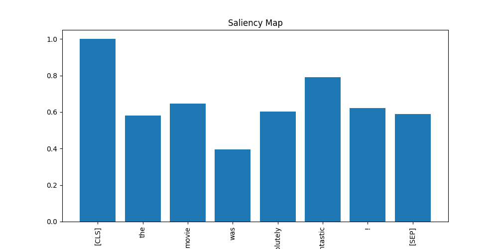
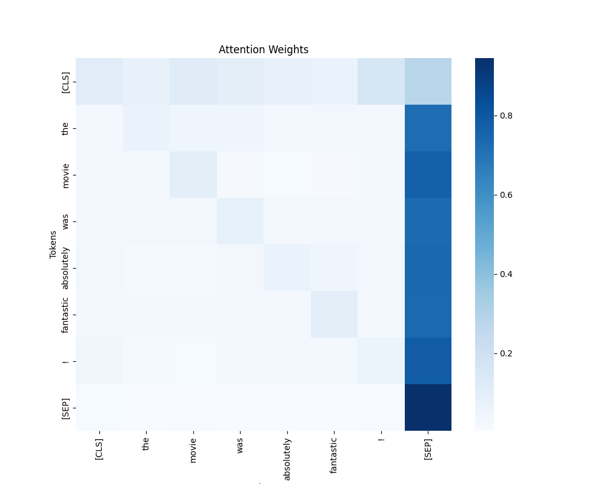

# [WIP] Model Understanding with Saliency and Attention Mapping

This repository provides tools for exploring and understanding transformer-based models using saliency maps and attention visualizations. By analyzing saliency and attention, users can gain insights into how models make predictions or generate text, which helps in debugging and interpreting model behavior.

## Features

- **Saliency Maps**: Visualize token importance by computing gradients of the input with respect to model outputs.
- **Attention Visualizations**: Plot attention scores to understand token-to-token interactions.
- **Support for Classification Models**: Works with `AutoModelForSequenceClassification` from the Hugging Face Transformers library.
- **Support for Generative Models**: Compatible with `AutoModelForCausalLM` for analyzing autoregressive text generation.
- **Custom Visualizations**: Generate bar plots for saliency scores and heatmaps for attention weights.

## Installation

Clone the repository and install the required dependencies:

```bash
git clone https://github.com/sbartlet97/model-visualization.git
cd model-visualization
pip install -r requirements.txt
```

## Usage

### For Classification Models

```python
from model_understanding import ModelVisualizer

# Initialize the visualizer with a classification model
visualizer = ModelVisualizer("bert-base-uncased")

# Analyze a sample input text
input_text = "The movie was absolutely fantastic!"
visualizer.analyze(input_text)
```

### For Generative Models

```python
from model_understanding import GenerativeModelVisualizer

# Initialize the visualizer with a generative model
gen_visualizer = GenerativeModelVisualizer("gpt2")

# Analyze a sample prompt
prompt = "Once upon a time in a land far away,"
gen_visualizer.analyze(prompt)
```

### Outputs

1. **Saliency Map**: A bar plot showing the relative importance of each token in the input.
2. **Attention Weights**: A heatmap displaying token-to-token attention scores.

## Implementation Details

### ModelVisualizer

This class handles models for classification tasks. It computes saliency maps by backpropagating gradients through the model and extracts attention weights from the last layer.

- **Methods**:
  - `compute_saliency`: Computes normalized gradients for input tokens.
  - `compute_attention`: Averages attention scores across heads.
  - `plot_saliency`: Visualizes saliency as a bar plot.
  - `plot_attention`: Visualizes attention scores as a heatmap.

### GenerativeModelVisualizer

This class supports autoregressive models like GPT-2. It computes token saliency for the prompt and generates attention heatmaps for decoding steps.

- **Methods**:
  - `compute_saliency`: Uses the loss to compute input token gradients.
  - `compute_attention`: Extracts and averages attention scores across heads.
  - `plot_saliency`: Visualizes saliency as a bar plot.
  - `plot_attention`: Visualizes attention scores as a heatmap.

## Example Visualizations

### Saliency Map Example



### Attention Heatmap Example



## Dependencies

- `transformers`
- `torch`
- `matplotlib`
- `seaborn`

## License

This repository is licensed under the MIT License. See the `LICENSE` file for details.

## Contributing

Contributions are welcome! Please feel free to submit issues or pull requests.

